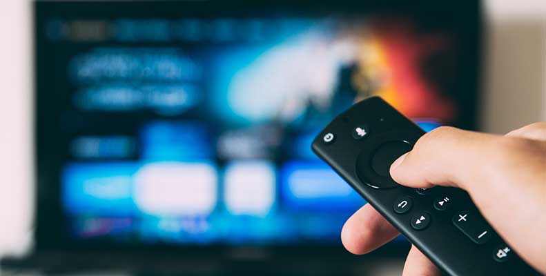

# Roku Flashback App Build, Part 1

## Descrption
* We are tasked with building the Flashback App for Roku devices as well as desktop and mobile.
* The Flashback app is part of the Roku streaming service. Subscribers can use this app to access three separate flashback features; movies, television, and music. Each of these three sections are comprised exclusively of entertainment from 1950-1990. 

## Requirements
* If viewing from a desktop or mobile, use a modern browser such as Google Chrome or view on your Roku app!

## Installation
* `CD` to the location of your choice, then `git clone` the project and browse away!

## Built With
* HTML
* CSS
* SASS
* JavaScript
* AJAX
* PHP
* Vue

## Authors
* Jordan Andrigo - Designer
* Tessa Benton-Cooper - Developer

* Photo by [Glenn Carstens-Peters](https://unsplash.com/@glenncarstenspeters?utm_source=unsplash&amp;utm_medium=referral&amp;utm_content=creditCopyText")